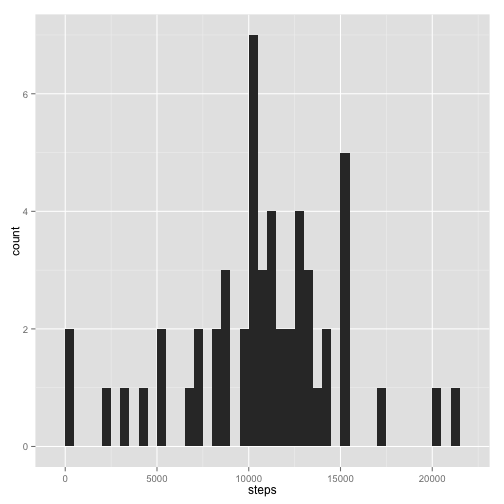
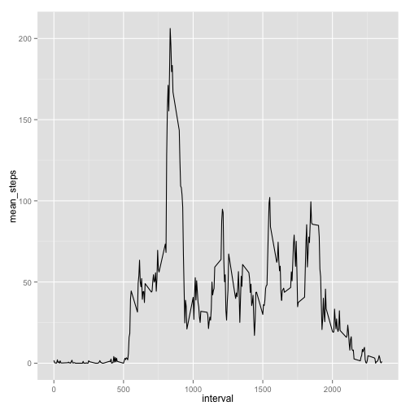
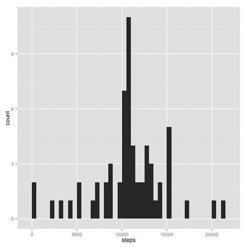
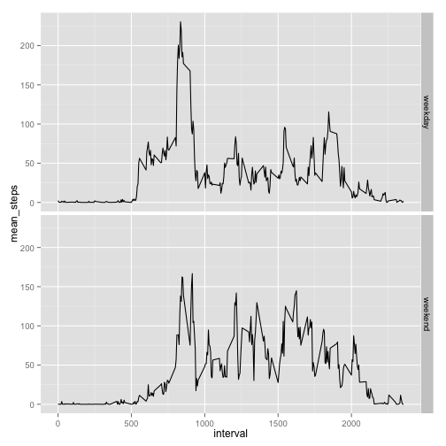

## Prerequisites and preconfigurations

Fot this assignment I am going to use `dplyr` library and `ggplot2`.
Also I'm going to set options to show fixed number instead of scientific notation and to show code chunks.

```r
    library(dplyr)
    library(ggplot2)
    options(scipen = 5, digits = 2)
    opts_chunk$set(echo=TRUE)
```

## Loading and preprocessing the data

Unpack the data archive if it's not done yet. Load the data and parse the date column.

```r
if (!file.exists("activity.csv")) {
    unzip("activity.zip")
}

data <- read.csv("activity.csv")
data$date <- as.Date(data$date)
```


## What is mean total number of steps taken per day?

Below is a histogram of the total number of steps taken each day.

```r
steps_per_day <- data %>%
    na.omit() %>%
    group_by(date) %>%
    summarise(steps=sum(steps))

qplot(steps, data=steps_per_day, geom="histogram", binwidth=500)
```

 

The mean is 10766.19 and the median is 10765 of the total number of steps taken per day.

## What is the average daily activity pattern?

Below is a time series plotof the 5-minute interval and the average number of steps taken, averaged across all days.


```r
mean_steps_per_interval <- data %>%
    na.omit() %>%
    group_by(interval) %>%
    summarise(mean_steps=mean(steps))

qplot(interval, mean_steps, data=mean_steps_per_interval, geom="line")
```

 

835-th interval (5-minute each), on average across all the days in the dataset, contains the maximum number of steps.

## Imputing missing values

The total number of rows that miss steps values is 2304

Fill missing values with the mean of 5 minutes interval.


```r
fix_na_data <- data %>%
    filter(is.na(steps)) %>%
    inner_join(mean_steps_per_interval, by="interval") %>%
    select(steps=mean_steps, date, interval) %>%
    rbind(., data %>% filter(!is.na(steps))) %>%
    arrange(date, interval)

fix_na_steps_per_day <- fix_na_data %>%
    group_by(date) %>%
    summarise(steps=sum(steps))

fix_na_steps_per_day %>%
    qplot(steps, data=., geom="histogram", binwidth=500)
```

 

The mean is 10766.19 and the median is 10766.19 of the total number of steps taken per day including imputed missing values.

As we see the imputation of missing values does not have big effect on the mean and median.
Although it has influence on histogram. We could see that the bar that is located in the middle has increased considerably.

## Are there differences in activity patterns between weekdays and weekends?

Below is a panel plot containing a time series plot of the 5-minute intervaland the average number of steps taken, averaged across all weekday days or weekend days.


```r
    fix_na_data %>%
        mutate(weekperiod=factor(ifelse(weekdays(date) %in% c("Saturday", "Sunday"), "weekend", "weekday"))) %>%
    group_by(weekperiod, interval) %>%
    summarise(mean_steps=mean(steps)) %>%
    qplot(interval, mean_steps, data=., geom="line", facets=weekperiod~.)
```

 

As we could see that there are most steps in the morning for weekdays and less steps during work hours.
The steps in weekend is more evenly distributed. There are more steps in work hours in weekend then in corespond time during workdays. 
